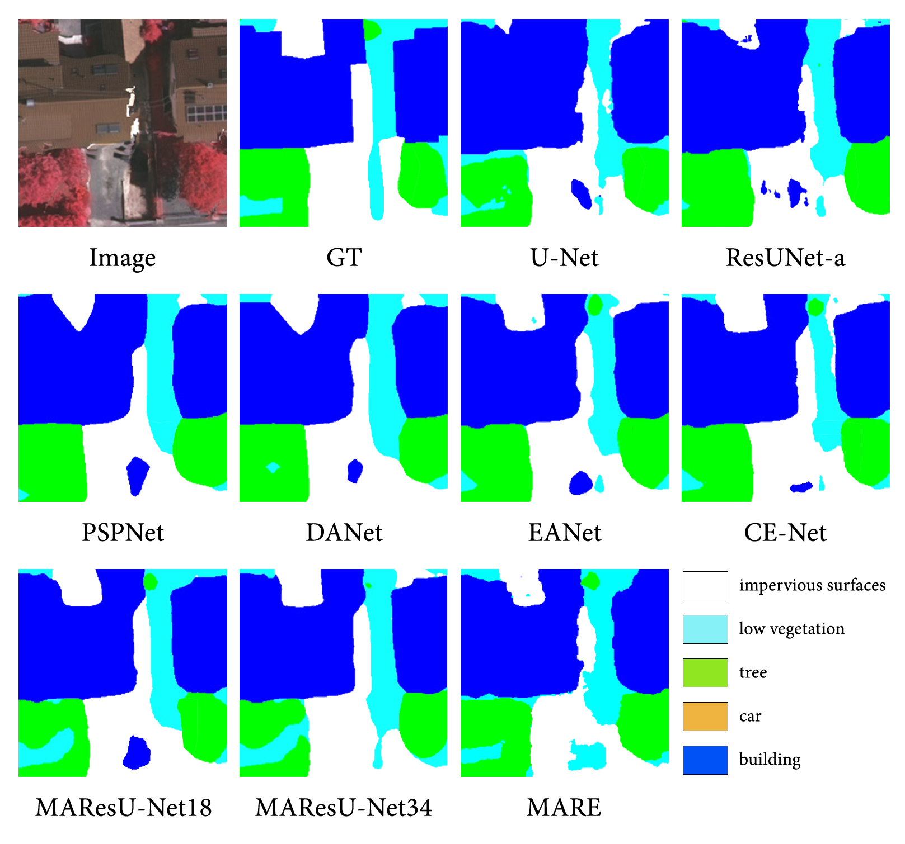
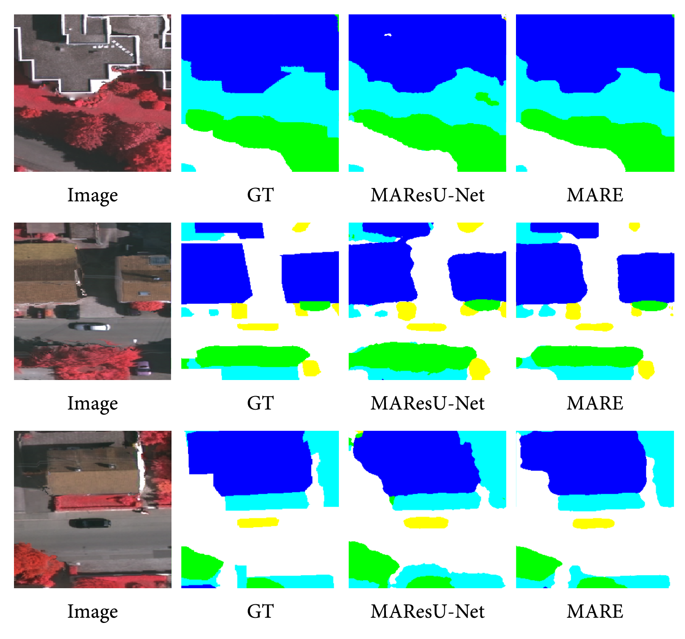

# MARE: self-supervised Multi-Attention REsu-net for semantic segmentation in remote sensing

Scene understanding of satellite and aerial images is a pivotal task in various remote sensing (RS) applications, such as land cover and urban development monitoring. In recent years, neural networks, especially convolutional neural networks (CNNs), have become a de-facto standard in many of these applications, including object detection and disparity map creation, commonly reaching state-of-the-art performance. However, semantic segmentation still remains a challenging task. With respect to other computer vision (CV) areas, in which large repositories of annotated image data can be easily found and processed, in RS large labeled datasets are not very often available, due to their large cost and to the required manpower. On the other hand, self-supervised learning (SSL) is earning more and more interest in CV, reaching state-of-the-art in several tasks. In spite of this, most SSL models, pretrained on huge datasets like ImageNet, do not perform particularly well on RS data, due to their own peculiarities. For this reason, we propose a combination of a SSL algorithm (particularly, Online Bag of Words) and a semantic segmentation algorithm, shaped for aerial images (namely, MAResU-Net), to show new encouraging results on the ISPRS Vaihingen benchmark dataset.

<div align="center"></div>

## Contents
1. [Features](#features)
2. [Installation](#installation)
3. [Usage](#usage)
4. [Pretrained Model](#output)
5. [License](#license)
<!-- 6. [Citation](#citation) -->

## Features

To deal with the challenge of limited annotated training data for RS segmentation, we rely on self-supervised learning to learn powerful representations, that can tap on the potential of the large amount of unlabeled data, readily available in RS. 
Particularly, we decided to use Online Bag of Words ([OBOW](https://arxiv.org/abs/2012.11552)), because it relies on the use of visual words, which are visual concepts localized in the spatial domain (as opposed to global concepts as in most other SSL methods). This could be beneficial for dense predictions tasks such as semantic segmentation. Furthermore, it exhibits very strong empirical performance.
In the picture, some visual words are presented.

<div align="center"></div>

On the other hand, we decided to rely on Multi-stage Attention ResU-Net ([MAResU-Net](https://arxiv.org/abs/2011.14302)), for the semantic segmentation task, because of several reasons. U-Net-based architectures have proven to be an excellent choice for image segmentation tasks that provides solid performance. The use of self-attention mechanism has shown to provide high-capacity models that can properly take advantage of large scale datasets. Finally, to deal with the high computational cost of self-attention, we extend the solution proposed by MAResU-Net

MARE performs new encouraging results on the ISPRS Vaihingen benchmark dataset, as the examples show.

<div align="center"></div>

## Installation

- Download [Python 3](https://www.python.org/)
- Install the packages:
```bash
pip install -r requirements.txt
```

## Usage 

To train the OBOW, follow the instructions in [OBOW repo](https://github.com/valeoai/obow/tree/main/obow).

Then, to train the segmentation model, insert the information in the .yaml in the Config directory.

Finally, run the code:

```bash
python train.py --config="Op1"
```


## Pretrained Model

At this [link](https://drive.google.com/file/d/18Ty0aUDflPjvONNszzo14JI0GjP1Rbed/view?usp=sharing), the pretrained model is available.

## License

This is an open access article distributed under the [Creative Commons Attribution License](https://creativecommons.org/licenses/by/4.0/) which permits unrestricted use, distribution, and reproduction in any medium, provided the original work is properly cited.

<!-- ## Citation

```bash
to do
``` -->
